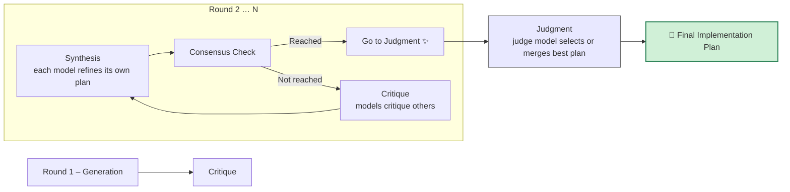

# `mcp-sage`

An MCP (Model Context Protocol) server that provides tools for sending prompts to either OpenAI's O3 model or Google's Gemini 2.5 Pro based on token count. The tools embed all referenced filepaths (recursively for folders) in the prompt. This is useful for getting second opinions or detailed code reviews from a model that can handle tons of context accurately.

## Rationale

I make heavy use of Claude Code. It's a great product that works well for my workflow. Newer models with large amounts of context seem really useful though for dealing with more complex codebases where more context is needed. This lets me continue to use Claude Code as a development tool while leveraging the large context capabilities of O3 and Gemini 2.5 Pro to augment Claude Code's limited context.

## Model Selection

The server automatically selects the appropriate model based on token count and available API keys:

- For smaller contexts (≤ 200K tokens): Uses OpenAI's O3 model (if OPENAI_API_KEY is set)
- For larger contexts (> 200K and ≤ 1M tokens): Uses Google's Gemini 2.5 Pro (if GEMINI_API_KEY is set)
- If the content exceeds 1M tokens: Returns an informative error

Fallback behavior:
- **API Key Fallback**:
  - If OPENAI_API_KEY is missing, Gemini will be used for all contexts within its 1M token limit
  - If GEMINI_API_KEY is missing, only smaller contexts (≤ 200K tokens) can be processed with O3
  - If both API keys are missing, an informative error is returned

- **Network Connectivity Fallback**:
  - If OpenAI API is unreachable (network error), the system automatically falls back to Gemini
  - This provides resilience against temporary network issues with one provider
  - Requires GEMINI_API_KEY to be set for fallback to work

## Inspiration

This project draws inspiration from two other open source projects:

- [simonw/files-to-prompt](https://github.com/simonw/files-to-prompt) for the file compression
- [asadm/vibemode](https://github.com/asadm/vibemode) for the idea and prompt to send the entire repo to Gemini for wholesale edit suggestions

## Overview

This project implements an MCP server that exposes three tools:

### `sage-opinion`

1. Takes a prompt and a list of file/dir paths as input
2. Packs the files into a structured XML format
3. Measures the token count and selects the appropriate model:
   - O3 for ≤ 200K tokens
   - Gemini 2.5 Pro for > 200K and ≤ 1M tokens
4. Sends the combined prompt + context to the selected model
5. Returns the model's response

### `sage-review`

1. Takes an instruction for code changes and a list of file/dir paths as input
2. Packs the files into a structured XML format
3. Measures the token count and selects the appropriate model:
   - O3 for ≤ 200K tokens
   - Gemini 2.5 Pro for > 200K and ≤ 1M tokens
4. Creates a specialized prompt instructing the model to format responses using SEARCH/REPLACE blocks
5. Sends the combined context + instruction to the selected model
6. Returns edit suggestions formatted as SEARCH/REPLACE blocks for easy implementation

### `sage-plan`

1. Takes a prompt requesting an implementation plan and a list of file/dir paths as input
2. Packs the files into a structured XML format
3. Orchestrates a multi-model debate to generate a high-quality implementation plan
4. Models critique and refine each other's plans through multiple rounds
5. Returns the winning implementation plan with detailed steps

### 🧠 sage-plan — Multi-Model & Self-Debate Workflows
The `sage-plan` tool doesn't ask a single model for a plan.  
Instead it orchestrates a structured **debate** that runs for one or more rounds and then asks a separate judge model (or the same model in CoRT mode) to pick the winner.

--------------------------------------------------------------------
#### 1. Multi-Model Debate Flow


• **Round 1 (Generation)** – Every available model (`A`, `B`, `C`, …) writes its own "Implementation Plan".  
• **Round 1 (Critique)** – Each model receives the other plans (never its own) and produces structured critiques.  

For **Rounds 2 … N** (`N` defaults to 3):
1. **Synthesis** – Each model improves its previous plan using the critiques it received.
2. **Consensus Check** – The judge model scores similarity of the current plans.  
   • If score ≥ 0.9, the debate stops early and jumps to **Judgment**.  
3. **Critique** – If consensus is not reached **and we are not in the last round**, each model critiques the others again, then the loop repeats.

**Judgment Phase** – After the last round *or* an early consensus, the judge model (O3 by default) receives all remaining plans and:
- Picks the single best plan **or**
- Merges them into a superior plan.  
It also returns a **confidence score**.

--------------------------------------------------------------------
#### 2. Self-Debate (CoRT) Flow – Single Model Available
```mermaid
flowchart TD
  C1[Generate Plan 1] --> C2[Generate Plan 2] --> C3[Generate Plan 3]
  C3 --> R2[Round 2 – Self-Refinement]
  R2 --> R3[Round 3 – Self-Refinement]
  R3 --> FCoRT[🏁 Final Plan (best of all)]
  
  style FCoRT fill:#D0F0D7,stroke:#2F855A,stroke-width:2px
```

When only one model is available:

1. **Initial Burst** – The model writes three distinct plans (diverse approaches).
2. **Self-Refinement Rounds (2…N)** –  
   • The model reviews its earlier plans, critiques them internally, then produces an improved version each round.  
3. **Final Selection** – The last revision becomes the final implementation plan.

--------------------------------------------------------------------
### What Actually Happens in Code (quick reference)

| Phase / Functionality | Code Location | Notes |
|-----------------------|---------------|-------|
| Generation Prompts    | prompts/debatePrompts.generatePrompt | Adds heading "# Implementation Plan (Model X)" |
| Critique Prompts      | prompts/debatePrompts.critiquePrompt | Uses "## Critique of Plan {ID}" sections |
| Synthesis Prompts     | prompts/debatePrompts.synthesizePrompt | Model revises its own plan |
| Consensus Check       | debateOrchestrator.checkConsensus    | Judge model returns JSON with `consensusScore` |
| Judgment              | prompts/debatePrompts.judgePrompt    | Judge returns "# Final Implementation Plan" + confidence |
| Self-Debate Prompt    | prompts/debatePrompts.selfDebatePrompt | Chain-of-Recursive-Thoughts loop |

#### Performance and Cost Considerations

**⚠️ Important:** The sage-plan tool can:
- Take a significant amount of time to complete (5-15 minutes with multiple models)
- Consume substantial API tokens due to multiple rounds of debate
- Incur higher costs than single-model approaches

**Typical resource usage:**
- Multi-model debate: 2-4x more tokens than a single model approach
- Processing time: 5-15 minutes depending on complexity and model availability
- API costs: $0.30-$1.50 per plan generation (varies by models used and plan complexity)

## Prerequisites

- Node.js (v18 or later)
- A Google Gemini API key (for larger contexts)
- An OpenAI API key (for smaller contexts)

## Installation

```bash
# Clone the repository
git clone https://github.com/your-username/mcp-sage.git
cd mcp-sage

# Install dependencies
npm install

# Build the project
npm run build
```

## Environment Variables

Set the following environment variables:

- `OPENAI_API_KEY`: Your OpenAI API key (for O3 model)
- `GEMINI_API_KEY`: Your Google Gemini API key (for Gemini 2.5 Pro)

## Usage

After building with `npm run build`, add the following to your MCP configuration:

```sh
OPENAI_API_KEY=your_openai_key GEMINI_API_KEY=your_gemini_key node /path/to/this/repo/dist/index.js
```

You can also use environment variables set elsewhere, like in your shell profile.

## Prompting

To get a second opinion on something just ask for a second opinion.

To get a code review, ask for a code review or expert review.

Both of these benefit from providing paths of files that you wnat to be included in context, but if omitted the host LLM will probably infer what to include.

### Debugging and Monitoring

The server provides detailed monitoring information via the MCP logging capability. These logs include:

- Token usage statistics and model selection
- Number of files and documents included in the request
- Request processing time metrics
- Error information when token limits are exceeded

Logs are sent via the MCP protocol's `notifications/message` method, ensuring they don't interfere with the JSON-RPC communication. MCP clients with logging support will display these logs appropriately.

Example log entries:
```
Token usage: 1,234 tokens. Selected model: o3-2025-04-16 (limit: 200,000 tokens)
Files included: 3, Document count: 3
Sending request to OpenAI o3-2025-04-16 with 1,234 tokens...
Received response from o3-2025-04-16 in 982ms
```

```
Token usage: 235,678 tokens. Selected model: gemini-2.5-pro-preview-03-25 (limit: 1,000,000 tokens)
Files included: 25, Document count: 18
Sending request to Gemini with 235,678 tokens...
Received response from gemini-2.5-pro-preview-03-25 in 3240ms
```

### Using the Tools

#### sage-opinion Tool

The `sage-opinion` tool accepts the following parameters:

- `prompt` (string, required): The prompt to send to the selected model
- `paths` (array of strings, required): List of file paths to include as context

Example MCP tool call (using JSON-RPC 2.0):

```json
{
  "jsonrpc": "2.0",
  "id": 1,
  "method": "tools/call",
  "params": {
    "name": "sage-opinion",
    "arguments": {
      "prompt": "Explain how this code works",
      "paths": ["path/to/file1.js", "path/to/file2.js"]
    }
  }
}
```

#### sage-review Tool

The `sage-review` tool accepts the following parameters:

- `instruction` (string, required): The specific changes or improvements needed
- `paths` (array of strings, required): List of file paths to include as context

Example MCP tool call (using JSON-RPC 2.0):

```json
{
  "jsonrpc": "2.0",
  "id": 1,
  "method": "tools/call",
  "params": {
    "name": "sage-review",
    "arguments": {
      "instruction": "Add error handling to the function",
      "paths": ["path/to/file1.js", "path/to/file2.js"]
    }
  }
}
```

The response will contain SEARCH/REPLACE blocks that you can use to implement the suggested changes:

```
<<<<<<< SEARCH
function getData() {
  return fetch('/api/data')
    .then(res => res.json());
}
=======
function getData() {
  return fetch('/api/data')
    .then(res => {
      if (!res.ok) {
        throw new Error(`HTTP error! Status: ${res.status}`);
      }
      return res.json();
    })
    .catch(error => {
      console.error('Error fetching data:', error);
      throw error;
    });
}
>>>>>>> REPLACE
```

#### sage-plan Tool

The `sage-plan` tool accepts the following parameters:

- `prompt` (string, required): Description of what you need an implementation plan for
- `paths` (array of strings, required): List of file paths to include as context

Example MCP tool call (using JSON-RPC 2.0):

```json
{
  "jsonrpc": "2.0",
  "id": 1,
  "method": "tools/call",
  "params": {
    "name": "sage-plan",
    "arguments": {
      "prompt": "Create an implementation plan for adding user authentication to this application",
      "paths": ["src/index.js", "src/models/", "src/routes/"]
    }
  }
}
```

The response contains a detailed implementation plan with:

1. High-level architecture overview
2. Specific implementation steps
3. File changes needed
4. Testing strategy
5. Potential challenges and mitigations

This plan benefits from the collective intelligence of multiple AI models (or thorough self-review by a single model) and typically contains more robust, thoughtful, and detailed recommendations than a single-pass approach.

## Running the Tests

To test the tools:

```bash
# Test the sage-opinion tool
OPENAI_API_KEY=your_openai_key GEMINI_API_KEY=your_gemini_key node test/run-test.js

# Test the sage-review tool
OPENAI_API_KEY=your_openai_key GEMINI_API_KEY=your_gemini_key node test/test-expert.js

# Test the sage-plan tool
OPENAI_API_KEY=your_openai_key GEMINI_API_KEY=your_gemini_key node test/run-sage-plan.js

# Test the model selection logic specifically
OPENAI_API_KEY=your_openai_key GEMINI_API_KEY=your_gemini_key node test/test-o3.js
```

**Note**: The sage-plan test may take 5-15 minutes to run as it orchestrates a multi-model debate.

## Project Structure

- `src/index.ts`: The main MCP server implementation with tool definitions
- `src/pack.ts`: Tool for packing files into a structured XML format
- `src/tokenCounter.ts`: Utilities for counting tokens in a prompt
- `src/gemini.ts`: Gemini API client implementation
- `src/openai.ts`: OpenAI API client implementation for O3 model
- `src/debateOrchestrator.ts`: Multi-model debate orchestration for sage-plan
- `src/prompts/debatePrompts.ts`: Templates for debate prompts and instructions
- `test/run-test.js`: Test for the sage-opinion tool
- `test/test-expert.js`: Test for the sage-review tool
- `test/run-sage-plan.js`: Test for the sage-plan tool
- `test/test-o3.js`: Test for the model selection logic

## License

ISC
