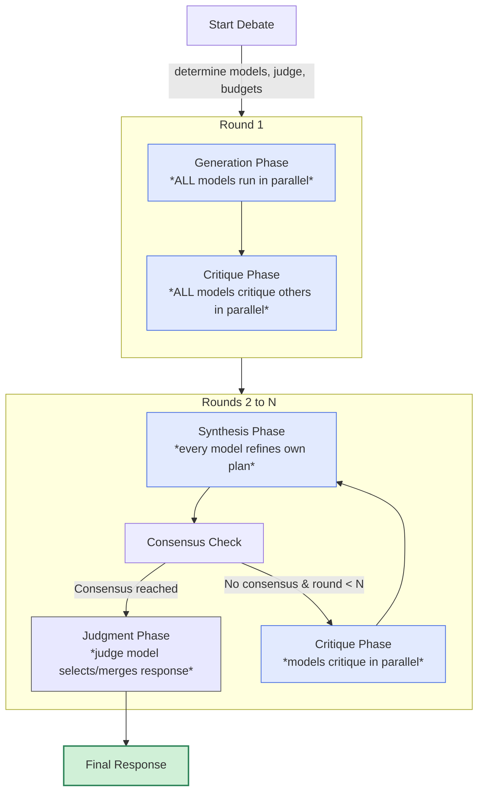
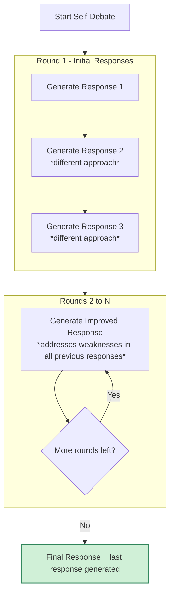

# `mcp-sage`
[](https://smithery.ai/server/@jalehman/mcp-sage)

An MCP (Model Context Protocol) server that provides tools for sending prompts to OpenAI's GPT-5, GPT-4.1, Google's Gemini 2.5 Pro, or Anthropic's Claude Opus 4.1 based on token count and configuration. The tools embed all referenced filepaths (recursively for folders) in the prompt. This is useful for getting second opinions or detailed code reviews from models that can handle large amounts of context accurately.

## Rationale

I make heavy use of Claude Code. It's a great product that works well for my workflow. Newer models with large amounts of context seem really useful though for dealing with more complex codebases where more context is needed. This lets me continue to use Claude Code as a development tool while leveraging the large context capabilities of GPT-5, Gemini 2.5 Pro, and other models to augment Claude Code's limited context.

## Model Selection

The server automatically selects the appropriate model based on token count, with configuration defined in `models.yaml`:

- For smaller contexts (≤ 400K tokens): Uses OpenAI's GPT-5 (if OPENAI_API_KEY is set)
- For medium contexts (≤ 1M tokens): Uses Google's Gemini 2.5 Pro (if GEMINI_API_KEY is set)  
- For fallback (≤ 1M tokens): Uses OpenAI's GPT-4.1
- If the content exceeds 1M tokens: Returns an informative error

Fallback behavior:
- **API Key Fallback**:
  - If OPENAI_API_KEY is missing, Gemini will be used for all contexts within its 1M token limit
  - If GEMINI_API_KEY is missing, only smaller contexts can be processed with OpenAI models
  - If required API keys are missing, an informative error is returned

## Inspiration

This project draws inspiration from two other open source projects:

- [simonw/files-to-prompt](https://github.com/simonw/files-to-prompt) for the file compression
- [asadm/vibemode](https://github.com/asadm/vibemode) for the idea and prompt to send the entire repo to Gemini for wholesale edit suggestions
- [PhialsBasement/Chain-of-Recursive-Thoughts](https://github.com/PhialsBasement/Chain-of-Recursive-Thoughts) inspiration for the debate functionality

## Overview

This project implements an MCP server that exposes two primary tools:

### `sage-opinion`

1. Takes a prompt and a list of file/dir paths as input
2. Packs the files into a structured XML format
3. Measures the token count and selects the appropriate model:
   - GPT-5 for ≤ 400K tokens
   - Gemini 2.5 Pro for > 400K and ≤ 1M tokens
   - GPT-4.1 as fallback for ≤ 1M tokens
4. Sends the combined prompt + context to the selected model
5. Returns the model's response

### `sage-review`

1. Takes an instruction for code changes and a list of file/dir paths as input
2. Packs the files into a structured XML format
3. Measures the token count and selects the appropriate model:
   - GPT-5 for ≤ 400K tokens
   - Gemini 2.5 Pro for > 400K and ≤ 1M tokens
   - GPT-4.1 as fallback for ≤ 1M tokens
4. Creates a specialized prompt instructing the model to format responses using SEARCH/REPLACE blocks
5. Sends the combined context + instruction to the selected model
6. Returns edit suggestions formatted as SEARCH/REPLACE blocks for easy implementation

### Debate Mode

Both `sage-opinion` and `sage-review` support an optional debate mode that can be enabled by adding `debate: true` to the arguments. When enabled, the system orchestrates a structured debate between multiple models to generate higher-quality responses.

--------------------------------------------------------------------
#### 1. Multi-Model Debate Flow


Key phases in the multi-model debate:

**Setup Phase**
- The system determines available models, selects a judge, and allocates token budgets

**Round 1**
- **Generation Phase** - Every available model (A, B, C, etc.) generates its response in parallel
- **Critique Phase** - Each model reviews all other responses (never its own) and produces structured critiques in parallel

**Rounds 2 to N** (N defaults to 3)
1. **Synthesis Phase** - Each model improves its previous response using critiques it received (models work in parallel)
2. **Consensus Check** - The judge model scores similarity between all current responses
   - If score ≥ 0.9, the debate stops early and jumps to Judgment
3. **Critique Phase** - If consensus is not reached AND we're not in the final round, each model critiques all other responses again (in parallel)

**Judgment Phase**
- After completing all rounds (or reaching early consensus), the judge model (Claude Opus 4.1 by default):
  - For sage-opinion: Selects the single best response (no synthesis)
  - For sage-review: Can either select the best response OR merge multiple responses
  - Provides a confidence score for its selection/synthesis

--------------------------------------------------------------------
#### 2. Self-Debate Flow - Single Model Available


When only one model is available, a [Chain of Recursive Thoughts (CoRT)](https://github.com/PhialsBasement/Chain-of-Recursive-Thoughts) approach is used:

1. **Initial Burst** - The model generates three distinct responses, each taking a different approach
2. **Refinement Rounds** - For each subsequent round (2 to N, default N=3):
   - The model reviews all previous responses
   - It critiques them internally, identifying strengths and weaknesses
   - It produces one new improved response that addresses limitations in earlier responses
3. **Final Selection** - The last response generated becomes the final output

--------------------------------------------------------------------
### What Actually Happens in Code (quick reference)

| Phase / Functionality | Code Location | Notes |
|-----------------------|---------------|-------|
| Generation Prompts    | prompts/debatePrompts.generatePrompt | Creates initial responses from each model |
| Critique Prompts      | prompts/debatePrompts.critiquePrompt | Uses "## Critique of {ID}" sections |
| Synthesis Prompts     | prompts/debatePrompts.synthesizePrompt | Model revises its own response |
| Consensus Check       | orchestrator/debateOrchestrator | Judge model returns JSON with `consensusScore` |
| Judgment              | prompts/debatePrompts.judgePrompt    | Judge returns final response + confidence |
| Self-Debate Prompt    | prompts/debatePrompts.selfDebatePrompt | [Chain-of-Recursive-Thoughts](https://github.com/PhialsBasement/Chain-of-Recursive-Thoughts) loop |

#### Performance and Cost Considerations

**⚠️ Important:** When using debate mode:
- It can take more time to complete (2-5 minutes with multiple models)
- Consumes more API tokens due to multiple rounds of debate
- Incurs higher costs than single-model approaches

**Typical resource usage:**
- Multi-model debate: 2-4x more tokens than a single model approach
- Processing time: 2-5 minutes depending on complexity and model availability
- API costs vary by models used and complexity

## Prerequisites

- Node.js (v18 or later)
- API keys for the models you want to use:
  - **OpenAI API key** (for GPT-5 and GPT-4.1)
  - **Google Gemini API key** (for Gemini 2.5 Pro)
  - **Anthropic API key** (for Claude Opus 4.1 as judge in debates)

**Note:** While the server can function with just one API key, it works best when all three are provided. This enables:
- Optimal model selection based on token count
- Multi-model debates for higher quality responses
- Claude Opus 4.1 as an impartial judge in debate mode

## Installation

### Installing via Smithery

To install Sage for Claude Desktop automatically via [Smithery](https://smithery.ai/server/@jalehman/mcp-sage):

```bash
npx -y @smithery/cli install @jalehman/mcp-sage --client claude
```

### Installing manually

```bash
# Clone the repository
git clone https://github.com/your-username/mcp-sage.git
cd mcp-sage

# Install dependencies
npm install

# Build the project
npm run build
```

## Environment Variables

Set the following environment variables:

- `OPENAI_API_KEY`: Your OpenAI API key (for GPT-5 and GPT-4.1 models)
- `GEMINI_API_KEY`: Your Google Gemini API key (for Gemini 2.5 Pro)
- `ANTHROPIC_API_KEY`: Your Anthropic API key (for Claude Opus 4.1)

**Recommended:** Provide all three API keys for the best experience. This ensures:
- The server can select the optimal model for any token count
- Debate mode works with multiple diverse models
- Claude Opus 4.1 serves as an effective judge in debates

## Usage

After building with `npm run build`, add the following to your MCP configuration:

```sh
OPENAI_API_KEY=your_openai_key GEMINI_API_KEY=your_gemini_key node /path/to/this/repo/dist/index.js
```

You can also use environment variables set elsewhere, like in your shell profile.

## Prompting

To get a second opinion on something just ask for a second opinion.

To get a code review, ask for a code review or expert review.

Both of these benefit from providing paths of files that you wnat to be included in context, but if omitted the host LLM will probably infer what to include.

### Debugging and Monitoring

The server provides detailed monitoring information via the MCP logging capability. These logs include:

- Token usage statistics and model selection
- Number of files and documents included in the request
- Request processing time metrics
- Error information when token limits are exceeded

Logs are sent via the MCP protocol's `notifications/message` method, ensuring they don't interfere with the JSON-RPC communication. MCP clients with logging support will display these logs appropriately.

Example log entries:
```
Token usage: 1,234 tokens. Selected model: gpt-5-2025-08-07 (limit: 400,000 tokens)
Files included: 3, Document count: 3
Sending request to OpenAI gpt-5-2025-08-07 with 1,234 tokens...
Received response from gpt-5-2025-08-07 in 982ms
```

```
Token usage: 435,678 tokens. Selected model: gemini-2.5-pro (limit: 1,000,000 tokens)
Files included: 25, Document count: 18
Sending request to Gemini with 435,678 tokens...
Received response from gemini-2.5-pro in 3240ms
```

### Using the Tools

#### sage-opinion Tool

The `sage-opinion` tool accepts the following parameters:

- `prompt` (string, required): The prompt to send to the selected model
- `paths` (array of strings, required): List of file paths to include as context
- `debate` (boolean, optional): Enable multi-model debate mode for higher quality responses

Example MCP tool call (using JSON-RPC 2.0):

```json
{
  "jsonrpc": "2.0",
  "id": 1,
  "method": "tools/call",
  "params": {
    "name": "sage-opinion",
    "arguments": {
      "prompt": "Explain how this code works",
      "paths": ["path/to/file1.js", "path/to/file2.js"]
    }
  }
}
```

#### sage-review Tool

The `sage-review` tool accepts the following parameters:

- `instruction` (string, required): The specific changes or improvements needed
- `paths` (array of strings, required): List of file paths to include as context
- `debate` (boolean, optional): Enable multi-model debate mode for higher quality responses

Example MCP tool call (using JSON-RPC 2.0):

```json
{
  "jsonrpc": "2.0",
  "id": 1,
  "method": "tools/call",
  "params": {
    "name": "sage-review",
    "arguments": {
      "instruction": "Add error handling to the function",
      "paths": ["path/to/file1.js", "path/to/file2.js"]
    }
  }
}
```

The response will contain SEARCH/REPLACE blocks that you can use to implement the suggested changes:

```
<<<<<<< SEARCH
function getData() {
  return fetch('/api/data')
    .then(res => res.json());
}
=======
function getData() {
  return fetch('/api/data')
    .then(res => {
      if (!res.ok) {
        throw new Error(`HTTP error! Status: ${res.status}`);
      }
      return res.json();
    })
    .catch(error => {
      console.error('Error fetching data:', error);
      throw error;
    });
}
>>>>>>> REPLACE
```

When using debate mode with either tool, the system will:

1. Generate initial responses from multiple models (GPT-5 and Gemini by default)
2. Have models critique each other's responses
3. Allow models to refine their responses based on critiques
4. Use a judge model (Claude Opus 4.1 by default) to select or synthesize the best response

This results in more thoughtful and comprehensive responses at the cost of additional time and API usage.

## Running the Tests

To test the tools:

```bash
# Test the sage-opinion tool
OPENAI_API_KEY=your_openai_key GEMINI_API_KEY=your_gemini_key node test/run-test.js

# Test the sage-review tool
OPENAI_API_KEY=your_openai_key GEMINI_API_KEY=your_gemini_key node test/test-expert.js

# Test debate mode
OPENAI_API_KEY=your_openai_key GEMINI_API_KEY=your_gemini_key ANTHROPIC_API_KEY=your_anthropic_key node test/run-sage-opinion-debate.js
```

**Note**: Tests using debate mode may take 2-5 minutes to run as they orchestrate multi-model interactions.

## Project Structure

- `src/index.ts`: The main MCP server implementation with tool definitions
- `src/pack.ts`: Tool for packing files into a structured XML format
- `src/tokenCounter.ts`: Utilities for counting tokens in a prompt
- `src/gemini.ts`: Gemini API client implementation
- `src/openai.ts`: OpenAI API client implementation for O3 model
- `src/orchestrator/debateOrchestrator.ts`: Multi-model debate orchestration
- `src/prompts/debatePrompts.ts`: Templates for debate prompts and instructions
- `test/run-test.js`: Test for the sage-opinion tool
- `test/test-expert.js`: Test for the sage-review tool
- `test/run-sage-opinion-debate.js`: Test for debate mode functionality

## License

ISC
